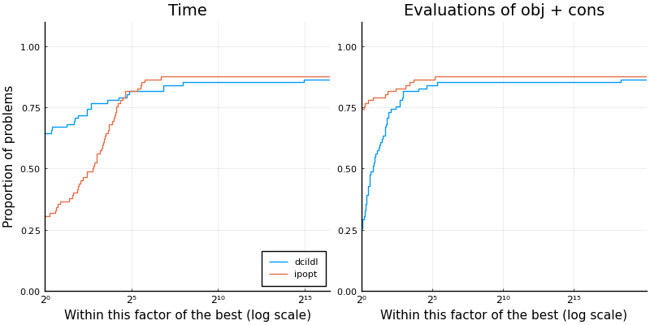

# Summary

`Percival.jl` [@percival-jl] is a new Julia [@bezanson2017julia] implementation of a matrix-free augmented Lagrangian algorithm (MF-AL), as introduced by @Arreckx2015, to address nonlinear nonconvex continuous optimization problems with both equality and inequality constraints
\begin{equation}\label{eq:nlp}
    \minimize{x \in \R^n} \ f(x) \quad \st \ c_L \leq c(x) \leq c_U, \ \ell \leq x \leq u,
\end{equation}
where  $f:\mathbb{R}^n \rightarrow \mathbb{R}$ and  $c:\mathbb{R}^n \rightarrow \mathbb{R}^m$ are (twice) continuously differentiable functions, with  $c_L \in \left(\mathbb{R} \cup \{-\infty\} \right)^m$,  $c_U \in \left(\mathbb{R} \cup \{+\infty\} \right)^m$,  $\ell \in \left(\mathbb{R} \cup \{-\infty\} \right)^n$, and  $u \in \left(\mathbb{R} \cup \{+\infty\} \right)^n$.
Bounds on the variables appear separately from other types of constraints because numerical methods often treat them differently.
MF-AL is an iterative method that aims to compute a local minimum of \eqref{eq:nlp} using first and second-order derivatives.

Our initial motivation for considering \eqref{eq:nlp} and developing `Percival.jl` is to solve PDE-constrained optimization problems, for instance, the design of aircraft wings, including coupled aerodynamic and structural optimization [@Arreckx2015].
In many of such engineering design problems, it is not computationally feasible or realistic to store Jacobians or Hessians explicitly.
Matrix-free implementations of standard optimization methods—implementations that do not explicitly form Jacobians and Hessians.
The matrix-free approach makes solving problems with thousands of design variables and constraints tractable, even if function and gradient evaluations are costly.

The augmented Lagrangian algorithm, employed in MF-AL, follows a penalty method approach, where it iteratively tackles a sequence of simpler (but not necessarily simple) optimization problems.
First, MF-AL reformulates \eqref{eq:nlp} into an equality-constrained problems with bounds
\begin{equation}\label{eq:nlp-eq}
    \underset{x \in \mathbb{R}^n}{\text{minimize}} \quad f(x) \quad \text{subject to} \quad c(x) = 0, \ell \leq x \leq u,
\end{equation}
using slack variables on inequalities, transforming them into equalities.
Then, MF-AL solves a sequence of bound-constrained optimization problems moving the equality constraints in the objective via an augmented Lagrangian penalty.
To efficiently handle such problems, MF-AL leverages TRON [@tron], a specialized matrix-free solver tailored for bound-constrained optimization.
Note that if the initial problem only consists of equality constraints, the subproblem simplifies to an unconstrained optimization problem.

`Percival.jl` is built upon the JuliaSmoothOptimizers (JSO) tools [@jso].
JSO is an academic organization containing a collection of Julia packages for nonlinear optimization software development, testing, and benchmarking.
It provides tools for building models, accessing problems repositories, and solving subproblems.
`Percival.jl` takes as input an `AbstractNLPModel`, JSO's general model API defined in `NLPModels.jl` [@nlpmodels], a flexible data type to evaluate objective and constraints, their derivatives, and to provide any information that a solver might request from a model.
The user can hand-code derivatives, use automatic differentiation, or use JSO-interfaces to classical mathematical optimization modeling languages such as AMPL [@fourer2003ampl], CUTEst [@cutest], or JuMP [@jump]. 

Internally, `Percival.jl` combines cutting-edge optimization and numerical linear algebra solvers.
The bound-constrained optimization problems are solved using TRON [@tron] implemented in `JSOSolvers.jl` [@jsosolvers].
Thanks to JSO's abstraction of a JSO-compliant solver it would be straightforward to use trust-region or adaptive regularization with cubics implemented in `JSOSolvers.jl` [@jsosolvers] or `AdaptiveRegularization.jl` [@adaptiveregularization].
These solvers relies heavily on iterative linear algebra methods from `Krylov.jl` [@krylov], which provides more than 35 implementations of standard and novel Krylov methods.
Notably, Krylov.jl support various floating-point systems compatible with Julia and provides GPU acceleration through backends that build on GPUArrays.jl [@GPUArrays], including CUDA.jl [@besard2018juliagpu], AMDGPU.jl [@amdgpu], and oneAPI.jl [@oneAPI], the Julia interfaces to NVIDIA, AMD, and Intel GPUs.

# Statement of need

Julia's JIT compiler is attractive for the design of efficient scientific computing software, and, in particular, mathematical optimization [@lubin2015computing], and has become a natural choice for developing new solvers.

There already exist ways to solve \eqref{eq:nlp} in Julia.
If \eqref{eq:nlp} is amenable to being modeled in `JuMP` [@jump], the model may be passed to state-of-the-art solvers, implemented in low-level compiled languages, via wrappers thanks to Julia's native interoperability with such languages.
However, interfaces to low-level languages have limitations that pure Julia implementations do not have, including the ability to apply solvers with various arithmetic types.

Although most personal computers offer IEEE 754 single and double precision computations,
new architectures implement native computations in other floating-point systems.  In addition,
software libraries such as the GNU MPFR, shipped with Julia, let users experiment with
computations in variable, extended precision at the software level with the `BigFloat` data type.
Working in high precision has obvious benefits in terms of accuracy.

Algencan [@Algencan] is a Fortran implementation of a matrix-free Augmented Lagrangian type algorithm and is accessible in Julia via the wrapper `NLPModelsAlgencan.jl` [@NLPModelsAlgencan] (although it still requires a manual installation before).

`Optim.jl` [@mogensen2018optim] implements a factorization-based pure Julia primal-dual interior-point method for problems with both equality and inequality constraints modeled after Artlelys Knitro [@byrd2006k] and Ipopt [@wachter2006implementation].
`MadNLP.jl` [@Shin2021] is solver also based on the filter line-search interior point method (as in Ipopt) that can handle/exploit diverse classes of data structures, either on host or device memories.

Pure Julia alternatives to interior-point and augmented Lagrangian methods include `DCISolver.jl` [@dcisolver] that relies on a dynamic control of infeasibility or `FletcherPenaltySolver.jl` [@fletcherpenaltysolver] that implements Fletcher's penalty method for nonlinear optimization models. However, both methods are currently limited to equality constrained problems.

## Support for NVIDIA, AMD and Intel GPUs

The implementations in Krylov.jl are generic so as to take advantage of
the multiple dispatch and broadcast features of Julia. Those allow the implementations to be
specialized automatically by the compiler for both CPU and GPU. Thus, Krylov.jl works with
GPU backends that build on GPUArrays.jl, including CUDA.jl, AMDGPU.jl, and oneAPI.jl, the
Julia interfaces to NVIDIA, AMD, and Intel GPUs.

## Support for any floating-point system supported by Julia

Yes!

## In-place methods

All solvers in Krylov.jl have an in-place variant that allows to solve multiple linear systems with
the same dimensions, precision and architecture. Optimization methods such as the Newton
and Gauss-Newton methods can take advantage of this functionality by allocating workspace
for the solve only once. The in-place variants only require a Julia structure that contains all the
storage needed by a Krylov method as additional argument. In-place methods limit memory
allocations and deallocations, which are particularly expensive on GPUs.

## Numerics

`Percival.jl` can solve large-scale problems and can be benchmarked easily against other JSO-compliant solvers using `SolverBenchmark.jl` [@orban-siqueira-solverbenchmark-2020].
We include below performance profiles [@dolan2002benchmarking] of `Percival.jl` against Ipopt on 82 problems from CUTEst [@cutest] with up to 10,000 variables and 10,000 constraints. 

The package's documentation includes more extensive benchmarks on classical test sets showing that `Percival.jl` is also competitive with Artelys Knitro.

<!--
illustrating that `Percival` is a fast and stable alternative to a state of the art solver

NOTE: Putting the code is too long
```
include("make_problems_list.jl") # setup a file `list_problems.dat` with problem names
include("benchmark.jl") # run the benchmark and store the result in `ipopt_dcildl_82.jld2`
include("figures.jl") # make the figure
```
-->

{ width=100% }

# Acknowledgements

Dominique Orban is partially supported by an NSERC Discovery Grant.

# References
